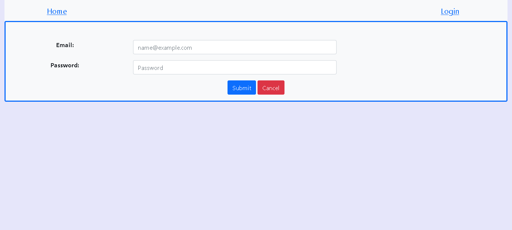

# Exam #1: "StudyPlan"
## Student: s301174 BERTORELLE PIETRO

## React Client Application Routes

- Route `/`: element={NavigationBar}, it is at the top of the screen and contains the login/logout link and a link that redirect to home.
- Route index: element={MainLayout}, it is printed as Outlet below the NavigationBar and it contains the study plan if present with: the actual and limit credits or the part-time/full-time option, the study plan table in which each row has the remove botton and on the bottom of the table there are save, cancel and delete buttons.
below on the same page there is the table with the whole exam list in which each row contains all the information of the exam and a show more/less button and if the studyplan is in edit mode a + button.
- Route `*`: element={NotFoundLayout}, it appears when the user goes to an unexpected route, it contains a button to return to the home('/')

the routes that follow are present only when logged in:

- Route `/add`: MainLayout, this route rerender the client when a studyplan is created, avoiding to use another state.
- Route `/add/:code`: MainLayout, this route rerender the client when an exam is added to the studyplan table. the code param is the exam's code but it's not used by the application.
-Route `/remove/:code`: MainLayout, this route rerender the client when an exam is removed from the studyplan table. the code param is the exam's code but it's not used by the application.

## API Server

//USER API

- POST `/api/sessions`
  - description: perform the login
  - request body content: {"username":"testuser@polito.it","password":"password"}
  - response body content: {"username":"testuser@polito.it"}
  
- GET `/api/sessions/current`
  - description: check if a client is already logged in
  - request body: empty
  - response body: {"username":"testuser@polito.it"}

- DELETE `/api/sessions/current`
  - description: perform the logout
  - request and response body: empty

//EXAMS API

- GET `/api/all`
  - description: get the list of all exams
  - request body: empty
  - response body: [{"code":"02GOLOV","name":"Architetture dei sistemi di elaborazione","credits":12,"maxStudents":null,"incompatibleWith":"02LSEOV","preparatoryCourse":null,"studentsEnrolled":0}, ... ]

//STUDYPLAN API

- GET `/api/studyplan`
  - description: get the study plan and the carrier option if they exist
  - request body: empty
  - response body: {"studyplan":[],"carrierOption":null}

- POST `/api/studyplan`
  - description: this api validates the study plan then save it and the carrier option, remove a student enrolled in the old study plan and add another to new courses if it's not present a timeout(in this case the student is already been added).
  - request body: {"studyplan":[{"code":"02GOLOV","name":"Architetture dei sistemi di elaborazione","credits":12,"maxStudents":null,"incompatibleWith":"02LSEOV","preparatoryCourse":null,"studentsEnrolled":0},...],"carrierOption":"parttime"}
  - response body: empty

- DELETE `/api/studyplan`
  - description: delete the study plan and carrier option, remove a student enrolled in all exams in the old study plan and delete the timeout if present in the current study plan.
  - request body: {"currentStudyplan":[{"code":"02GOLOV","name":"Architetture dei sistemi di elaborazione","credits":12,"maxStudents":null,"incompatibleWith":"02LSEOV","preparatoryCourse":null,"studentsEnrolled":0},...]}
  - response body: empty

//STUDENTS ENROLLED API

-POST `/api/studentsEnrolled`
  - description: add a student enrolled when an exam is added to the current study plan and set a timeout that after 20 minutes remove the student enrolled. it returns the current number of students enrolled of the exam or an error if the limit of students is reached.
  - request body: {"code":"01SQJOV"}
  - response body: {"studentsEnrolled":1}

## Database Tables - server/courses.db

- Table `exams` - contais the exams and all their informations even the students already enrolled. (01TXYOV, 02KPNOV and 01OTWOV are setted full)

	|code	|name|credits|maxStudents|incompatibleWith|preparatoryCourse|studentsEnrolled|
	|-------|-----------------------------------------------|--|----|---------------|-------|-|
	|02GOLOV|Architetture dei sistemi di elaborazione	|12|	|02LSEOV	|	|2|
	|02LSEOV|Computer architectures				|12|	|02GOLOV	|	|0|
	|01SQJOV|Data Science and Database Technology		|8|	|01SQMOV 01SQLOV|	|1|
	|02KPNOV|Tecnologie e servizi di rete			|6|3	|01OTWOV	|	|3|
	|01SQLOV|Database systems				|8|	|01SQJOV 01SQMOV|	|1|
	|01SQMOV|Data Science e Tecnologie per le Basi di Dati	|8|	|01SQJOV 01SQLOV|	|0|
	|01TYMOV|Information systems security services		|12|	|01UDUOV	|	|1|
	|05BIDOV|Ingegneria del software			|6|	|04GSPOV	|02GOLOV|1|
	|01OTWOV|Computer network technologies and services	|6|3	|02KPNOV	|	|3|
	|01UDUOV|Sicurezza dei sistemi informativi		|12|	|01TYMOV	|	|1|
	|01TXYOV|Web Applications I				|6|3	|01UDFOV	|	|3|
	|01UDFOV|Applicazioni Web I				|6|	|01TXYOV	|	|1|
	|04GSPOV|Software engineering				|6|	|05BIDOV	|02LSEOV|0|
	|02GRSOV|Programmazione di sistema			|6|	|01NYHOV	|	|0|
	|01NYHOV|System and device programming			|6|3	|02GRSOV	|	|1|
	|03UEWOV|Challenge					|5|	|		|	|0|
	|01URROV|Computational intelligence			|6|	|		|	|1|
	|01SQOOV|Reti Locali e Data Center			|6|	|		|	|1|
	|01TXSOV|Web Applications II				|6|	|		|01TXYOV|0|
	|01TYDOV|Software networking				|7|	|		|	|1|
	|01URSPD|Internet Video Streaming			|6|2	|		|	|0|
	|01OUZPD|Model based software design			|4|	|		|	|0|

- Table `users` - contains the usersname, the crypted password and the carrier option of each user

	|email			|hash									|salt					|carrierOption	|
	|-----------------------|-----------------------------------------------------------------------|---------------------------------------|---------------|
	|testuser@polito.it	|394d125c4c47f6b95a09a771bdf8be3bfcaa360707ec45312439b4b3bbaabeae	|649caafa5a6f2959519939210215b701	|parttime	|
	|s111111@polito.it	|df84859323c5057bbe2ac448777383e3ab6c07fb88696f03c5c3e015c6d809b5	|e9a2815a9b4a6fe9c5045925a92955ad	|fulltime	|
	|s222222@polito.it	|d8a2c988d0822cd7e1aff8ec7f2e3bc33bd6b5d380c7cdd7e34361fb86926595	|7cd745774b83d82bf19637d7999afb0e	|		|
	|s333333@polito.it	|7321b15a5ae7dd9aed8b36ec7082469fc208bdb01727457b215f5923cbc02462	|f0306fdd873051a49d46705b33555809	|		|
	|s444444@polito.it	|8a77d059118c4aad805e2b934beb159bd80fb7c5c08b1ae05acd40529152c0be	|d12e22e78ba24341b1b0ec355e8c2ad9	|		|

- Table `studyplan` - contains the studyplan as association between user and exams.

	|examCode	|username|
	|---------------|--------|
	|02GOLOV	|testuser@polito.it|
	|01SQJOV	|testuser@polito.it|
	|01TYMOV	|testuser@polito.it|
	|01SQLOV	|s111111@polito.it|
	|05BIDOV	|s111111@polito.it|
	|01NYHOV	|s111111@polito.it|
	|01URROV	|s111111@polito.it|
	|02GOLOV	|s111111@polito.it|
	|01UDUOV	|s111111@polito.it|
	|01SQOOV	|s111111@polito.it|
	|01TYDOV	|s111111@polito.it|
	|01UDFOV	|s111111@polito.it|

## Main React Components

-`App` (in App.js): here is defined the user and by a useEffect when the component render the first time the client check if it is already logged; are defined the routes.

- `MainLayout` (in 'components/Layout.js'): here are defined the exams list by useState, the study plan and the carrier option by useRef. it has a useEffect that get all the exams and, if the client is logged in, the study plan every time the props.user change, the use is defined in the app component in app.js. the MainLayout print the table of all exams and the study plan by calling: ExamTable(then ExamRow) and StudyplanTable. this component is printed as Outlet at the end of the NavigationBar.

- `LoginLayout` (in 'components/Layout.js): here there is a form in which the user can insert the email and the password that will be sent to the server when the Submit button is pressed. If a wrong username or password is sent an error message is printed.

- `ExamRow` (in 'components/ExamsLibrary.js'): is called by ExamTable and print the rows of the exams with the following header: Code, Name, Credits, Students Enrolled, Max Students and Action. the action tab contains a show more button that add a line bellow the exam with incompatible and preparatory courses; in student plan edit mode there is even a + button to add the exam to the study plan if all the conditions are respected otherwise it print an error above the exam line.

- `StudyplanTable` (in 'components/ExamsLibrary.js'): print the actual and the limit credits then call the StudyplanRow and at the bottom of this one add Save, Cancel and Delete buttons. When the Save button is pressed it verify that the actual credits are inside the limits.

- `StudyplanRow` (in 'components/ExamsLibrary.js'): print the studyplan's rows, the headers are: Code, Name, Credits and Actions because each row has a remove button that when is pressed remove the exam from the study plan if it's not a preparatory course of another exam inserted.

## Screenshot

**Home**:----------------------------------------------------------

Login:---------------------------------------------------------

---------------------------------------------------------------

Logged home:---------------------------------------------------

---------------------------------------------------------------

---------------------------------------------------------------

## Users Credentials

  |email	|		password|
|---|---|
|testuser@polito.it	|password|
|s111111@polito.it	|password|
|s222222@polito.it	|password|
|s333333@polito.it	|password|
|s444444@polito.it	|password|
